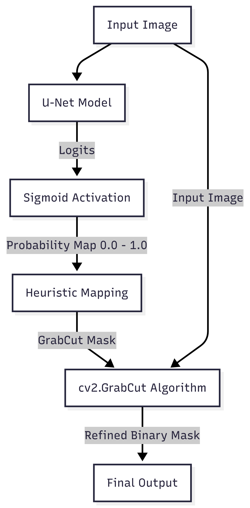

# Part 1: U-Net Model & Training Strategy

## 1. U-Net Architecture
We utilized the **U-Net** architecture, a convolutional neural network designed for biomedical image segmentation. Its "U" shape consists of:
- **Encoder (Contracting Path):** Extracts high-level features using convolutions and pooling.
- **Decoder (Expansive Path):** Recovers spatial resolution using up-convolutions.
- **Skip Connections:** Concatenate feature maps from the encoder to the decoder to preserve fine-grained spatial information lost during pooling.

### Key Modification: Logits Output
A critical modification in our implementation is the removal of the final `Sigmoid` activation layer from the model definition.
- **Standard Approach:** Typically, binary segmentation models end with `torch.sigmoid()` to output probabilities in $[0, 1]$.
- **Our Approach:** Our model outputs **raw logits** ($[-\infty, +\infty]$).
- **Reasoning:** This allows us to use `BCEWithLogitsLoss`, which is numerically more stable than applying `Sigmoid` followed by `BCELoss` separately. This is essential when using Automatic Mixed Precision (AMP).

## 2. Data Augmentation (Albumentations)
To ensure the U-Net generalizes well and provides robust initialization for GrabCut, we implemented an aggressive augmentation pipeline using `Albumentations`.

### Photometric Augmentations
These are crucial for identifying objects under varying lighting conditions, which is often a weakness of color-based algorithms like GrabCut.
- **RandomBrightnessContrast:** Simulates different exposure levels.
- **HueSaturationValue:** Varies color properties, forcing the model to learn structural features rather than relying solely on specific color shades.
- **CLAHE:** Enhances local contrast.
- **GaussianBlur:** Simulates out-of-focus imagery.

### Geometric Augmentations
- **ShiftScaleRotate:** Simulates variations in object position, size, and orientation.
- **HorizontalFlip:** Increases dataset diversity.

## 3. Training Setup
- **Optimizer:** Adam ($lr=1e-4$).
- **Mixed Precision:** We used `torch.amp` (Automatic Mixed Precision) to speed up training and reduce memory usage. This requires careful handling of loss scaling (`GradScaler`) to prevent gradient underflow.
- **Dataset Splitting:** We explicitly respected the COCO 2017 `train`/`val` split to ensure rigorous evaluation.

# Part 2: Loss Functions & Numerical Stability

## 1. The Challenge with Standard BCE
Binary Cross Entropy (BCE) is the standard loss for binary segmentation. It is defined as:
$$ \text{Loss} = - [y \cdot \log(p) + (1-y) \cdot \log(1-p)] $$
where $p = \sigma(x)$ is the predicted probability and $y$ is the ground truth.

However, computing `log(sigmoid(x))` can be numerically unstable.
- If $x$ is very large negative, $\sigma(x) \approx 0$, and $\log(0)$ explodes toward $-\infty$.
- If $x$ is very large positive, $1-\sigma(x) \approx 0$, causing similar issues.

## 2. Our Solution: BCEWithLogitsLoss
We used `torch.nn.BCEWithLogitsLoss`. This PyTorch function combines the Sigmoid layer and the BCE Loss in one single class.

### Mathematical Advantage (Log-Sum-Exp Trick)
It leverages the Log-Sum-Exp trick to rewrite the expression:
$$ \log(\sigma(x)) = \log\left(\frac{1}{1+e^{-x}}\right) = -\log(1+e^{-x}) $$
This formulation avoids explicit computation of exponentials that might overflow, ensuring high numerical stability. This is particularly important when training with **FP16 (Mixed Precision)** where the dynamic range is limited compared to FP32.

## 3. Dice Loss
In addition to BCE, we incorporated the **Dice Loss**.
- **Purpose:** COCO images often have a large background (negative class) and a small foreground object (positive class). BCE can sometimes prioritize the majority class.
- **Mechanism:** Dice Loss directly optimizes the Dice Coefficient (F1 Score equivalent), which measures the overlap between prediction and ground truth.
$$ \text{Dice} = \frac{2 |A \cap B|}{|A| + |B|} $$
- **Implementation Note:** Since our model outputs logits, we manually applied `torch.sigmoid()` within the `dice_loss` function before calculation.

## 4. Total Loss
$$ \mathcal{L}_{Total} = \mathcal{L}_{BCEWithLogits} + \mathcal{L}_{Dice} $$
This hybrid loss ensures both pixel-level accuracy (BCE) and global shape alignment (Dice).

# Part 3: The Hybrid Pipeline (Intelligent Scissor)

## 1. The Concept
The core idea is to use Deep Learning for **Semantic Understanding** (Where is the object generally?) and Classical Computer Vision for **Edge Refinement** (Where is the exact pixel boundary?).

## 2. Workflow Architecture

  

## 3. Heuristic Mapping & Thresholds
The output of the U-Net is a probability map where each pixel has a confidence score between 0 and 1. We map this to the 4 classes required by OpenCV's GrabCut:

| U-Net Probability ($P$) | Interpretation | GrabCut Class | Value |
| :--- | :--- | :--- | :--- |
| $P > 0.9$ | **Sure Foreground** | `cv2.GC_FGD` | 1 |
| $P < 0.1$ | **Sure Background** | `cv2.GC_BGD` | 0 |
| $0.1 \le P \le 0.9$ | **Uncertain / Probable** | `cv2.GC_PR_FGD` | 3 |

### Why these thresholds?
- **High Confidence (> 0.9):** The U-Net is very sure. We "lock" these pixels as foreground. GrabCut uses them to build the Gaussian Mixture Model (GMM) for the foreground color distribution.
- **Low Confidence (< 0.1):** The U-Net is very sure it's background. We lock these as background. GrabCut uses them to model the background color distribution.
- **Uncertain (0.1 - 0.9):** This is usually the **boundary region** (the "trimap"). This is where U-Net might be blurry or imprecise. We tell GrabCut: "We think this is foreground, but figure it out based on the color models you learned from the sure regions."

## 4. GrabCut Refinement
The `cv2.grabCut` algorithm is run in `GC_INIT_WITH_MASK` mode for 5 iterations.
- It iteratively updates the GMMs (Color Models) and creates a graph where pixels are nodes.
- It finds the **Min-Cut** of the graph, which corresponds to the optimal segmentation boundary that separates foreground from background along high-contrast edges.

**Result:** A segmentation that has the semantic correctness of the Neural Network but the sharp, pixel-perfect edges of the Graph Cut algorithm.
